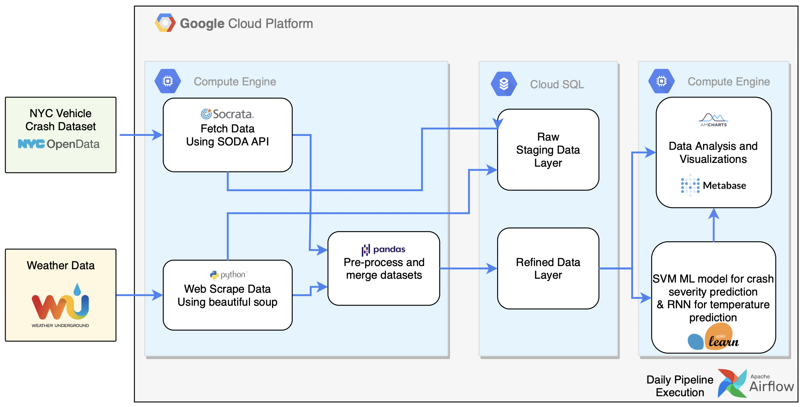

# NYC Vehicle Crash Analysis

### This repository has the code components for the project for EECS 6893 Big Data Analytics in Fall 2021

Team Members: Shivam Ojha(so2639), Abhishek Arora(aa4822), Animesh Bhasin(ab5051)

## Overview of the project
The project NYC Motor Vehicle Crash Analyses aims to understand correlations, patterns and analyze trends with the current weather conditions in the area of the crash. Further extending the scope, aim is to draw a relation with varying weather conditions, if the severity of the accident varies with it.
To develop this system end to end, first an ETL pipeline is setup to continuously ingest data from the NYC vehicle crash dataset and webscrape weather data with a daily update. The dataset contains about 2 million records. The next step involves cleaning the dataset and  backfilling missing values of zipcode, latitude, longitude etc. so that we have comprehensive data about each incident. We also scraped weather data from wunderground for each weather station in New York and store it in another table. This data is then processed and mapped with the crash dataset.

The workflow pipeline is orchestrated using an Airflow DAG, that runs on a daily schedule. After the dataset is completely ready, it is used for visualisation and prediction analysis. Machine learning models like logistic regression, support vector machines and Gradient Boosting Classifier are evaluated to predict the severity of a vehicle crash. Also, a recurrent neural network is trained to predict the weather conditions as well. The analysis and interactive visualisations on metabase and amcharts can help to understand the crash factors, high risk areas and a warning system that can warn users based on the historic data.

This repository contains the code files used to perform various tasks in the pipeline. The data analysis & predictions part is kept in the analysis_and_predictions directory and the visualizations code is kept in the visualizations directory.

## Dataset
In this project, we have used:
- [Motor vehicle crash dataset](https://data.cityofnewyork.us/Public-Safety/Motor-Vehicle-Collisions-Crashes/h9gi-nx95) from NYC Open data.
- Weather data from [wundergound](https://www.wunderground.com).
We first performed a historical load of both of these datasets starting from 2012. When the pipeline executes daily, the incremental load for both of these datasets takes place.
## System Architecture



## Organization of this directory

```
./
├── README.md
├── analysis_and_predictions
│   ├── README.md
│   ├── analyze_crash.py
│   ├── merge_datasets.py
│   └── predict_weather.py
├── get_crashes.py
├── get_weather.py
├── load_full_crashes_data.py
├── nyc_vehicle_crash_analysis_dag.py
├── preprocess_crash_data.py
├── preprocess_weather_data.py
├── requirements.txt
├── system_arch.png
├── utils
│   └── gmaps_api.py
└── visualizations
    ├── css
    │   └── style.css
    ├── index.html
    ├── js
    │   ├── am_bar_1.js
    │   ├── am_bar_chart_race.js
    │   ├── am_donut_pie.js
    │   ├── am_heatmap.js
    │   ├── am_stacked_column_chart.js
    │   ├── heatmap.js
    │   └── script.js
    └── json
        ├── config.json
        ├── data.json
        └── heatmap.json

6 directories, 26 files
